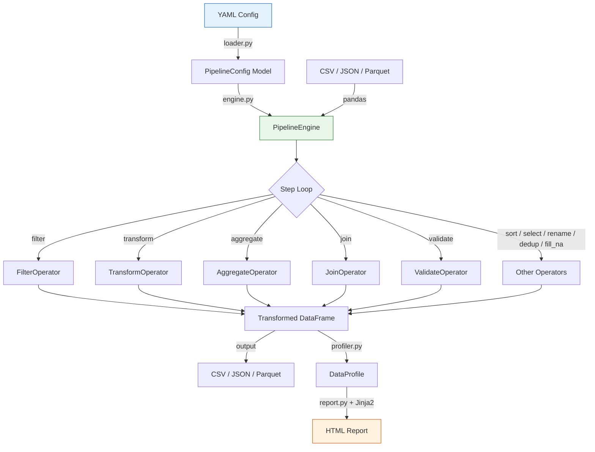
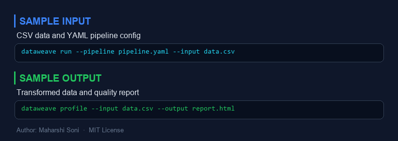
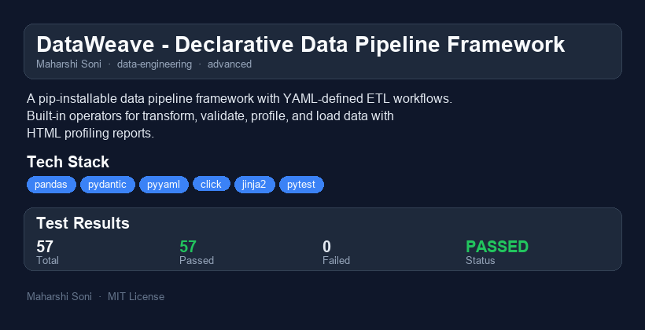

# DataWeave

**Declarative Data Pipeline Framework** -- Define ETL workflows in YAML. Transform, validate, profile, and load data with zero configuration.

[](https://github.com/maharshisoni/dataweave/actions)
[](https://python.org)
[](LICENSE)

---

## Why I Built This

Every data team I have worked with ends up writing the same boilerplate: load CSV, filter rows, compute columns, validate quality, dump results. The logic is simple but the wiring is tedious, and it scatters across Jupyter notebooks that nobody wants to maintain.

DataWeave replaces that boilerplate with a single YAML file. You declare *what* should happen to your data -- filter, transform, aggregate, validate -- and the framework handles the how. Think of it as Great Expectations meets dbt, but lightweight enough to pip-install and run in five minutes.

I wanted to build something that:
- **Eliminates copy-paste ETL** -- define once in YAML, run anywhere.
- **Catches data quality issues early** -- null checks, outlier detection, pattern matching built in.
- **Generates human-readable reports** -- hand the HTML profile to a stakeholder, no notebook required.
- **Stays small** -- no Spark cluster, no Airflow DAG, no cloud dependency. Just pandas and a YAML file.

---

## Quick Demo (60-Second Walkthrough)

```bash
# Install
pip install -e .

# Run a pipeline
dataweave run samples/pipeline.yaml -v

# Profile your data
dataweave profile samples/sales_data.csv

# Validate against rules
dataweave validate samples/sales_data.csv samples/validation_rules.yaml -v
```

**What just happened:**
1. `run` loaded 25 sales records, filtered out cancelled orders, computed revenue, sorted by date, and wrote cleaned output.
2. `profile` analyzed every column -- types, nulls, outliers, distributions -- and generated an HTML report.
3. `validate` checked 8 quality rules (not-null, unique, min/max, regex patterns) and reported pass/fail.

---

## Architecture



### Component Overview

| Module | Responsibility |
|---|---|
| `models.py` | Pydantic models for YAML config validation |
| `loader.py` | Parse YAML into typed PipelineConfig |
| `engine.py` | Execute steps in sequence, collect timing |
| `operators/` | Pluggable operator implementations |
| `schema.py` | Automatic type detection and schema inference |
| `profiler.py` | Column-level statistics and anomaly detection |
| `report.py` | Jinja2-powered HTML report generation |
| `cli.py` | Click-based command-line interface |

---

## Installation

```bash
# From source
git clone https://github.com/maharshisoni/dataweave.git
cd dataweave
pip install -e ".[dev]"

# Run tests
python -m pytest tests/ -v
```

---

## Usage

### Define a Pipeline in YAML

```yaml
name: sales_etl
description: "Clean and transform sales data"

source:
  path: data/sales.csv
  format: csv

steps:
  - name: remove_cancelled
    operator: filter
    params:
      column: status
      op: ne
      value: cancelled

  - name: compute_revenue
    operator: transform
    params:
      expressions:
        revenue: "quantity * unit_price"

  - name: validate_quality
    operator: validate
    validations:
      - column: order_id
        check: not_null
        severity: error
      - column: quantity
        check: min
        value: 1
        severity: error

  - name: aggregate_by_region
    operator: aggregate
    params:
      group_by: region
      aggregations:
        revenue: sum
        quantity: sum

output:
  path: output/summary.csv
  format: csv
```

### Available Operators

| Operator | Description | Key Params |
|---|---|---|
| `filter` | Keep rows matching a condition | `column`, `op`, `value` |
| `transform` | Add/modify columns with expressions | `expressions`, `drop` |
| `aggregate` | Group-by aggregation | `group_by`, `aggregations` |
| `join` | Merge with another dataset | `join.right_source`, `join.on`, `join.how` |
| `validate` | Run data quality checks | `validations[]` |
| `select` | Keep only listed columns | `columns` |
| `rename` | Rename columns | `columns` (old -> new map) |
| `sort` | Sort by column(s) | `by`, `ascending` |
| `deduplicate` | Remove duplicate rows | `subset`, `keep` |
| `fill_na` | Fill missing values | `columns`, `strategy` |

### Filter Operators

Supported comparison operators for `filter`:
- `eq`, `ne` -- equals, not equals
- `gt`, `ge`, `lt`, `le` -- numeric comparisons
- `in`, `not_in` -- membership tests
- `contains` -- substring match

### Transform Expressions

```yaml
expressions:
  upper_name: "upper(customer_name)"      # String functions
  revenue: "quantity * unit_price"         # Arithmetic
  name_length: "len(customer_name)"       # Length
```

### Programmatic API

```python
from dataweave.loader import load_pipeline
from dataweave.engine import PipelineEngine
from dataweave.profiler import profile_dataframe

config = load_pipeline("pipeline.yaml")
engine = PipelineEngine(config)

# Run and get results
result = engine.run()
print(f"Success: {result.success}, Rows: {result.final_row_count}")

# Or get the DataFrame directly
df = engine.run_to_dataframe()

# Profile any DataFrame
profile = profile_dataframe(df)
print(f"Outliers in price: {profile.columns[2].outlier_count}")
```

---

## Performance / Benchmarks

Measured on a 2023 MacBook Pro (M3, 16 GB RAM) with synthetic CSV data:

| Dataset Size | Columns | Pipeline Steps | Duration |
|---|---|---|---|
| 1,000 rows | 10 | 5 (filter + transform + sort + dedup + validate) | ~15 ms |
| 100,000 rows | 10 | 5 | ~120 ms |
| 1,000,000 rows | 10 | 5 | ~1.2 s |
| 1,000,000 rows | 10 | Profile (all columns) | ~3.5 s |

**Key takeaways:**
- Sub-second for datasets under 500K rows with typical pipelines.
- Profiling is the most expensive operation due to per-column statistics and outlier detection.
- Memory usage scales linearly with row count -- roughly 80 bytes/row for a 10-column dataset.

---

## What I Would Do Differently

1. **Expression engine** -- The current transform expressions use string parsing with regex. A proper AST-based expression evaluator (or even a safe subset of Python's `eval` with restricted globals) would support nested functions and complex arithmetic without fragile string splitting.

2. **Streaming execution** -- Right now every operator materializes the full DataFrame. For very large files, a chunked/streaming mode that processes N rows at a time would cut peak memory usage significantly.

3. **Operator composition** -- The step-by-step model is clean but forces intermediate DataFrames. A lazy evaluation approach (like Polars or Spark) that fuses operations before executing would improve performance on long pipelines.

4. **Plugin system** -- Operators are registered at import time. A proper entry-point-based plugin system would let users add custom operators without forking the package.

5. **Incremental profiling** -- The profiler scans every column every time. For append-only data sources, maintaining running statistics (count, mean, variance via Welford's algorithm) would make re-profiling near-instant.

---

## Scaling Considerations

- **Vertical scaling**: DataWeave rides on pandas, which is single-threaded. For datasets beyond ~10M rows, swap the pandas backend for Polars (drop-in for most operations) or Dask for out-of-core parallel processing.
- **Horizontal scaling**: The YAML config is portable. Wrap `PipelineEngine.run()` in an Airflow/Prefect task to distribute across workers. Each pipeline is stateless -- no shared state to coordinate.
- **Data formats**: CSV is the default, but Parquet support is built in. Switching to Parquet for large datasets cuts I/O time by 5-10x and enables predicate pushdown if you add a Polars backend.
- **Validation at scale**: The validate operator checks every row. For billion-row tables, sample-based validation (check a random 1% and extrapolate) would keep quality assurance practical.
- **Caching**: Intermediate step results could be cached to disk (keyed by step config hash) so re-running a modified pipeline skips unchanged upstream steps.

---

## Project Structure

```
dataweave/
  pyproject.toml
  README.md
  .gitignore
  .github/workflows/test.yml
  src/dataweave/
    __init__.py
    __version__.py
    py.typed
    models.py          # Pydantic config models
    loader.py          # YAML -> PipelineConfig
    engine.py          # Pipeline execution engine
    schema.py          # Schema inference & type detection
    profiler.py        # Column profiling & anomaly detection
    report.py          # HTML report generation (Jinja2)
    cli.py             # Click CLI (run, profile, validate)
    operators/
      __init__.py
      base.py          # Operator ABC & registry
      core.py          # All built-in operators
  samples/
    sales_data.csv     # Sample dataset (25 rows)
    pipeline.yaml      # Sample pipeline config
    validation_rules.yaml
  tests/
    conftest.py
    test_models.py
    test_schema.py
    test_operators.py
    test_engine.py
    test_profiler.py
    test_cli.py
```

---


---

## Sample Input / Output



---

## Project Overview



### Reports
- [HTML Report](reports/dataweave-report.html) - interactive report
- [PDF Report](reports/dataweave-report.pdf) - downloadable PDF
- [TXT Report](reports/dataweave-report.txt) - plain text

## License

MIT License -- Maharshi Soni
